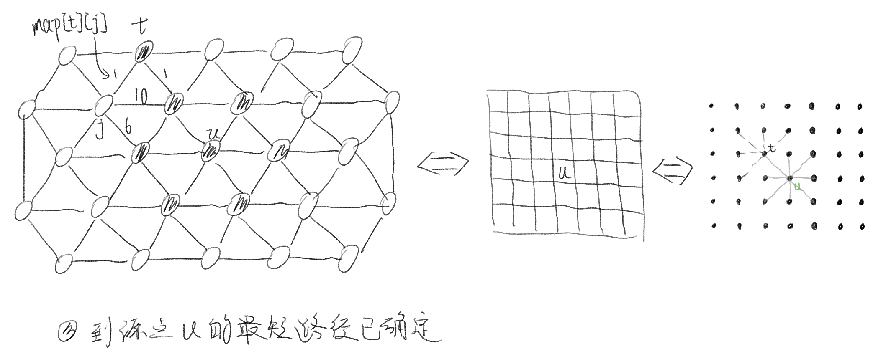
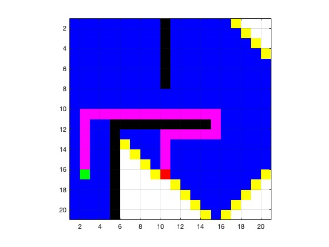
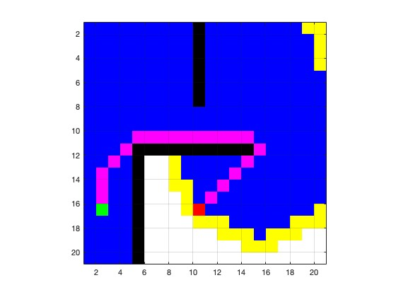

# Dijkstra算法

基于**贪心策略和广度优先(BFS)**，计算 **单源点** 到 其余各节点 最短路径的算法，解决的是**有向/无向有权(正权)图**中单源最短路径问题（负权问题可使用 `Bellman-Ford 算法`解决）。  

算法运行过程中可以将节点分为三类：  
- 已访问节点(已找到到源点的最短路径 如 Dijkstra_matlab 中的蓝点，Dijkstra_python.ipynb中的CLOSED列表中的点)
- 未访问节点
  - 已被检测到的节点(与 已检查节点 有连接关系 如 Dijkstra_matlab 中的黄点，Dijkstra_python.ipynb中的OPEN列表中的点)
  - 未被检测到的节点(与 已检查节点 无连接关系 如 Dijkstra_matlab 中的白点)

## 1. Dijkstra算法的基本思想  
> ### 解释1 （参考：[DSA Dijkstra's Algorithm (一个直观的教程)](https://www.w3schools.com/dsa/dsa_algo_graphs_dijkstra.php)）
> 1. Set initial distances for all vertices: 0 for the source vertex, and infinity for all the other.  
> 对所有节点设置初始距离：源点的初始距离为0，其他节点的初始距离为∞。  
> 2. Choose the unvisited vertex with the shortest distance from the start to be the current vertex. So the algorithm will always start with the source as the current vertex.  
> 在未访问节点中选择距离源点最近的节点最为当前节点（因此算法总会将源点作为第一个当前节点）。 
> 3. For each of the current vertex's unvisited neighbor vertices, calculate the distance from the source and update the distance if the new, calculated, distance is lower.  
> 对于当前节点的每一个未被访问邻居，计算该邻居经当前节点到源点的距离，如果该距离小于之前该邻居到源点的距离，则更新。  
> 4. We are now done with the current vertex, so we mark it as visited. A visited vertex is not checked again.  
> 将当前节点标记为已访问（已访问节点不再被检查）。  
> 5. Go back to step 2 to choose a new current vertex, and keep repeating these steps until all vertices are visited.  
> 回到步骤2，选择一个新的当前节点，重复后续步骤直到所有节点被访问或者终点被访问。  
> 6. In the end we are left with the shortest path from the source vertex to every other vertex in the graph.  
> 最后得到源点到所有其他节点的最短路径。

> ### 解释2
> 首先假定源点为u，顶点集合V被划分为两部分：集合 S 和 V-S。  
> 初始时S中仅含有源点u，其中S中的顶点到源点的最短路径已经确定。  
> V-S中所包含的顶点到源点的最短路径的长度待定，称从源点出发只经过S中的点到达V-S中的点的路径为**特殊路径**，并用dist[]记录当前每个顶点对应的最短特殊路径长度。  
> 选择**特殊路径**长度最短的路径，将其连接的V-S中的顶点加入到集合S中，同时更新数组dist[]。一旦S包含了所有顶点，dist[]就是从源到所有其他顶点的最短路径长度。  
> 1. 数据结构  
>    设置地图的带权邻接矩阵为map[][]，即如果从源点u到顶点i有边，就令map[u][i]=<u,i>的权值，否则map[u][i]=∞；  
>    采用一维数组dist[i]来记录从源点到i顶点的最短路径长度：采用一维数组p[i]来记录最短路径上i顶点的前驱。  
> 2. 初始化  
>    令集合S={u}，对于集合V-S中的所有顶点x，初始化dist[i]=map[u][i],如果源点u到顶点i有边相连，初始化p[i]=u(i的前驱是u),否则p[i]=-1  
> 3. 找最小  
>    在集合V-S中依照贪心策略来寻找使得dist[j]具有最小值的顶点t,即dist[t]=min，则顶点t就是集合V-S中距离源点u最近的顶点。  
> 4. 将顶点t加入集合S，同时更新V-S  
>    在 3 中已近找到了源点到t的最短路径，那么对集合V-S中所有与顶点t相邻的顶点j，都可以借助t走捷径。  
>    如果dist[j]>dist[t]+map[t][j],则dist[j]=dist[t]+map[t][j]，记录顶点j的前驱为t，p[j]=t  
>      
> 5. 判结束  
>    如果集合V-S为空，算法结束，否则转3  
> ————————————————  
> 版权声明：本文为CSDN博主「wjyGrit」的原创文章，遵循CC 4.0 BY-SA版权协议，转载请附上原文出处链接及本声明。  
> 原文链接：https://blog.csdn.net/qq_45776662/article/details/107177424

## 2. Dijkstra 与 动态规划 对比
[TODO]

## 3. 文件说明

|--- Dijkstra_matlab.mlx 基于**节点图**的Dijkstra算法的Matlab实时脚本实现  
   参考：[B站 小黎的Ally：路径规划与轨迹跟踪系列算法学习_第1讲_Dijkstra算法](https://www.bilibili.com/video/BV19T4y1M7uR/?spm_id_from=333.788.recommend_more_video.0&vd_source=be5bd51fafff7d21180e251563899e5e>)  
|--- Dijkstra_matlab 基于**栅格地图**的Dijkstra算法的Matlab实现  
   参考：[Github: sunzuolei/astar_dijkstra_rrt](https://github.com/sunzuolei/astar_dijkstra_rrt) 修改代码，实现斜线寻找路径，修改前后对比  

|||
|------------------------|------------------------|  

|--- Dijkstra_python.ipynb 基于**栅格地图**的Dijkstra算法的python实现(将原作者的python文件转为ipynb)  
参考：[Github: zhm-real/PathPlanning](https://github.com/zhm-real/PathPlanning)  
|--- imgs 相关图片   

## 4. 其他参考
- [Wiki: Dijkstra's algorithm](https://en.wikipedia.org/wiki/Dijkstra%27s_algorithm)
